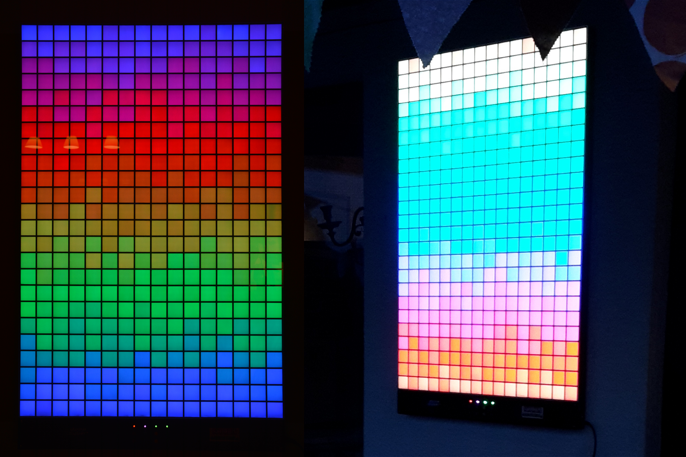
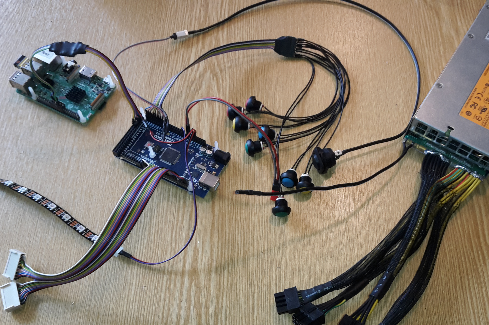
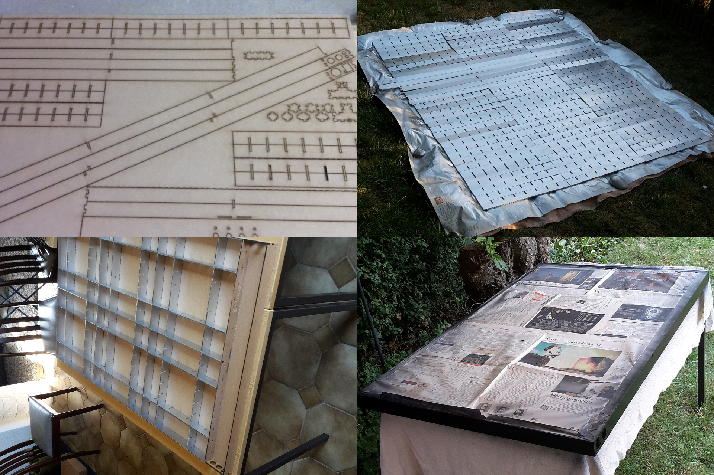
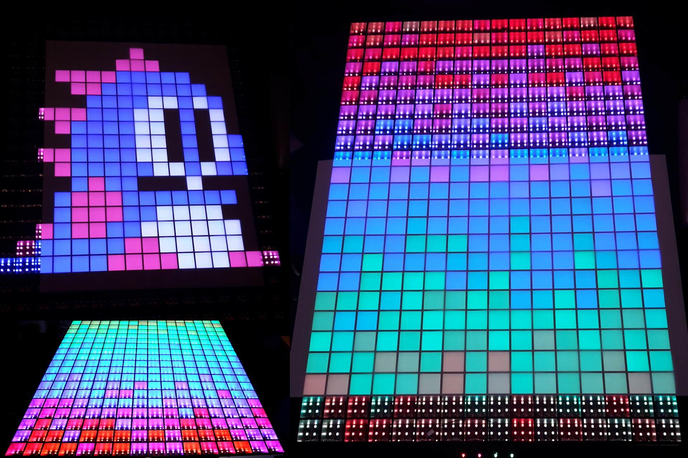

# Synopsis:

LED-based pixel wall for animations and tetris visualisation. Provides 16x24 RGB pixels on 80x120cm. LEDS are controlled with an Arduino, a Raspi provides input from arbitrary image or stream inputs including showing live Tetris games from NES input.

||
|---|
|Complete RGB-Tetris-LED-Wall|

# Hardware:

- WS2811 5050 LED strips (60leds/m, 20ics/m)
- 12V power supply (HP 750W HSTNS-PL18), provides 62.5A/12V
- Arduino Mega
- Raspberry PI 3 B
- EasyCAP USB grabber with Syntek STK1160 chip set
- Microphone: line in, perhaps with amplifier Iduino SE019
- Switches, Buttons, Photo-resistor,
- Case made from HDF, with cells of size 5x5x5cm, top layer is Transparenzpapier + 3mm clear acrylic

|||
|---|---|
|||

# Software:

## Arduino:

Purpose: direkt control of all LEDs via the FastLed library.
- controlled via buttons: mode (animations, images, beat dedection, NES Tetris stream, pixelflut), submode (e.g. which animation), speed, brightness
- adaptive brightness via a photo-resistor (with voltage divider via 5k1ohm resistor for input pulldown)
- annimations: library of 16+ animation patterns: rainbow, fire, plasma, ... 

Libraries (C):
- https://playground.arduino.cc/Code/ElapsedMillis
- https://github.com/FastLED/FastLED
- SPI

## Raspberry PI

Purpose: Proprocessing streams of input images, beat detection, NES tetris streams, and pixelflut.
- Image processing: cycles through all images that are located in /images
- Beat detection: Microphone measures sound for simple beat detection that can get visualised
- NES Tetris stream: reads the composite signal of an NES via the Syntek STK1160 grabber. All frames are analysed for the content of the Tetris game: game state, next block, score, level, number of lines
- Pixelflut (tm)

Libraries (python):
- base64
- numpy
- Pillow
- pigpio
- pyserial
- PyV4L2Camera
